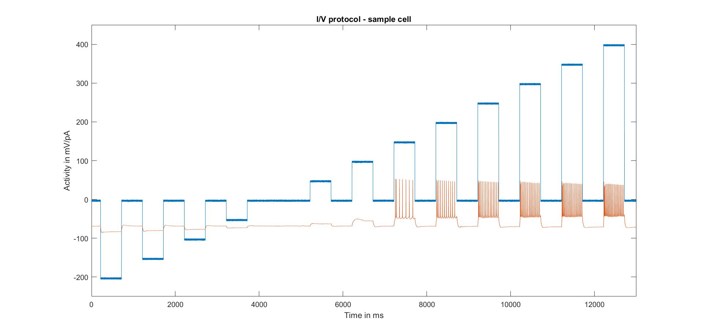
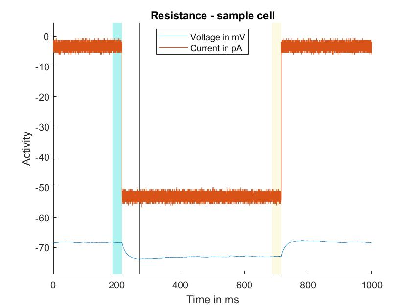
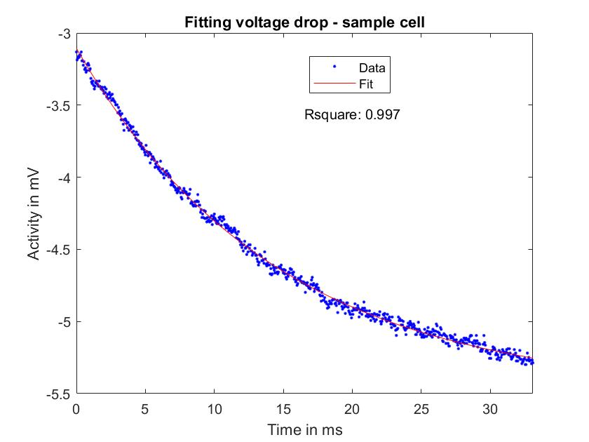

# Neuron-Phenotyping

I created several functions to extract neural firing characteristics based on neurophysiological, patch-clamping data. 
Specifically, in this experiment, recordings from both the patch-clamped and its surrounding cells were acquired. Thus, connectivity measures between cells, and electrophysiological properties of cells could be correlated. 

In a first step, I defined five electrophysiological properties of neurons that may be related to connectivity between neurons. Each property was extracted from each cell and saved in a struct, which was later used for clustering and correlation analysis.

1. Resistance & Conductance

Firstly, resistance was calculated as the ratio between change in voltage and change in current following relatively weak stimulation (so as to reduce the influence of other processes on the deltas of the two parameters).

Then, Capacitance was defined using the initial voltage drop following current induction and prior to voltage returning to baseline. Voltage-samples between the timepoints  of induction of current and reaching the peak of the voltage drop were extracted. A function describing the development of voltage after current induction was fit to the extracted samples, providing a measure of the tau time constant for each cell. Conductance was then calculated from the previously acquired resistance measure and tau.

2. 
