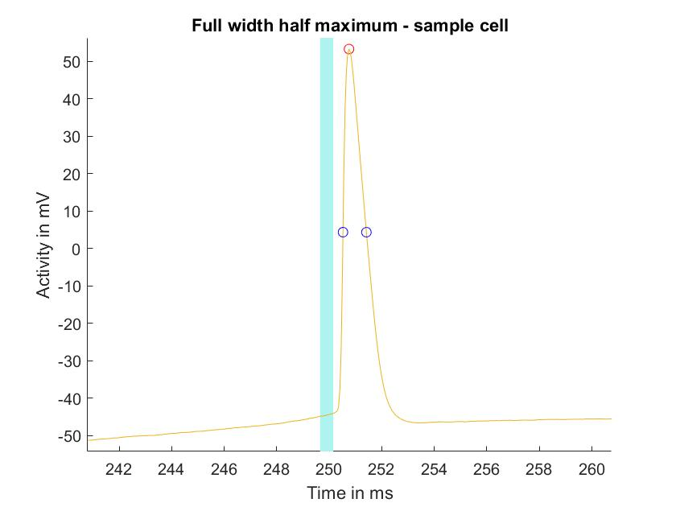
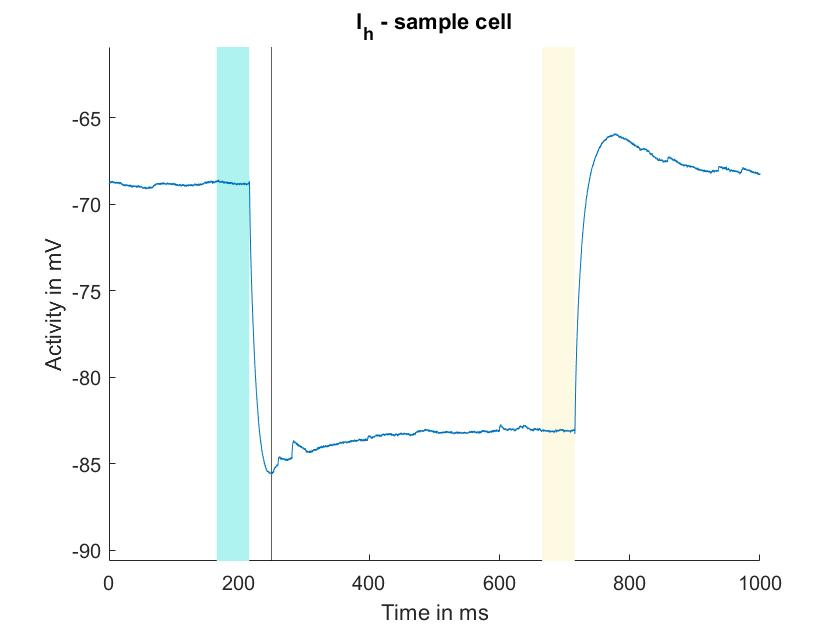
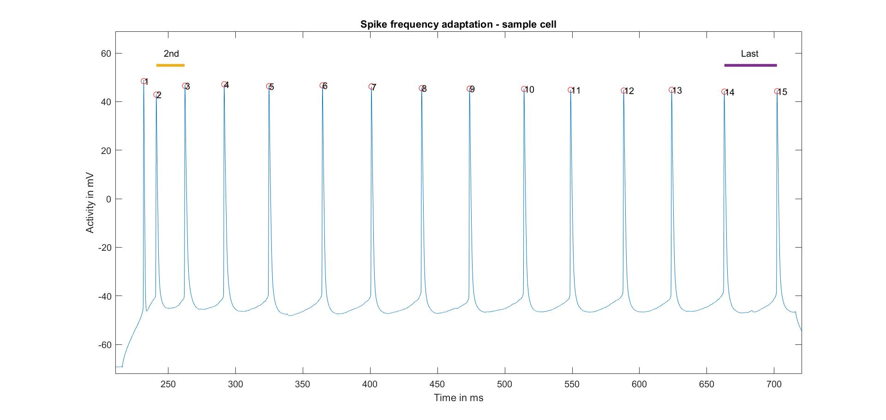

# Neuron-Phenotyping

I created several functions to extract neural firing characteristics based on neurophysiological, patch-clamping data. 
Specifically, in this experiment, recordings from both the patch-clamped and its surrounding cells were acquired. Thus, connectivity measures between cells, and electrophysiological properties of cells could be correlated. 

In a first step, I defined five electrophysiological properties of neurons that may be related to connectivity between neurons. Each property was extracted from each cell and saved in a struct, which was later used for clustering and correlation analysis.

**1/2. Resistance & Conductance**

Firstly, resistance was calculated as the ratio between change in voltage and change in current following relatively weak stimulation (so as to reduce the influence of other processes on the deltas of the two parameters).

Then, capacitance was defined using the initial voltage drop following current induction. Voltage-samples between the timepoints  of induction of current and reaching the peak of the voltage drop were extracted. A function describing the development of voltage after current induction was fit to the extracted samples, providing a measure of the tau time constant for each cell. Conductance was then calculated from the previously acquired resistance measure and tau.

**3. FWHM**

Next, the full-width half-maximum (FWHM) was calculated (using the first spike in the first spike train in a given cell). The start of the spike was localized as the first time point with a change in velocity above a certain threshold. The middle between the start voltage and peak voltage of the spike was taken as the cut-off for calculating the width of the spike.

**4. h-current/sag ratio**

Another interesting measure for phenotyping neurons is the h-current. The current is related to the 'sag' in voltage following hyperpolarization. I determined the negative voltage peak for a relatively weak hyperpolarizing current. I then computed the ratio of difference: (h_current - baseline) / (steady_state - baseline).

**5. Adaptation of neural firing**

Lastly, I looked at the adaptation of neural firing for each cell. I chose the spike train with the highest spike rate and calculated the ration between the second and the last time interval between spikes. This ratio gives a measure of how much the spiking of a neuron slows down with time. 

**Final: Results**

We then performed an explorative analysis, looking at correlations between electrophysiological, connectivity and location features of neurons. Here's an example of the relationship between the sag ratio and location along the dorso-medial axis of neurons: 

These analyses are part of the publication: 

Printz, Y., Patil, P., Mahn, M., Benjamin, A., Litvin, A., Levy, R., **Bringmann**, M., & Yizhar, O. (2021). Determinants of functional synaptic connectivity among amygdala-projecting prefrontal cortical neurons. BioRxiv. https://doi.org/10.1101/2021.11.07.467611

